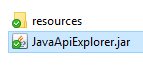
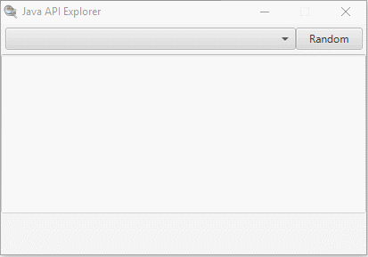

# JavaApiExplorer
A small JavaFX Program I made to explore the Java and JavaFX Classes.

## Usage

1. Download the latest release and the associated resources .zip.
2. Unzip the resources .zip file into the same directory as the JavaApiExplorer.jar, ensuring both sub-txt files are in the resources directory:
  
3. Double click on the JavaApiExplorer.jar to launch it.
4. Begin reviewing the Java/JavaFX classes.
  * You can review them at random:
  
  * Or you can select a class from the drop down:
  
  * Keep an eye out for the links at the bottom as well! One goes to the associated Javadoc for the given class, and the other goes to the associated page on https://www.programcreek.com/java-api-examples/index.php for the given class.
  
